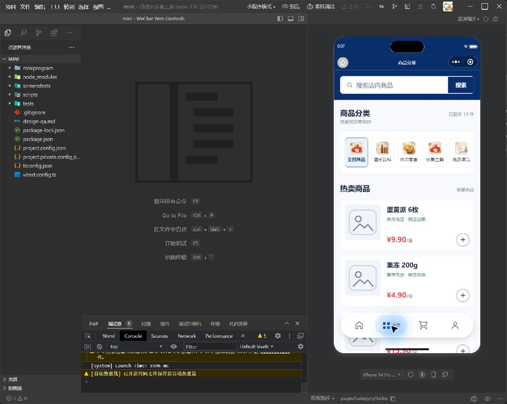
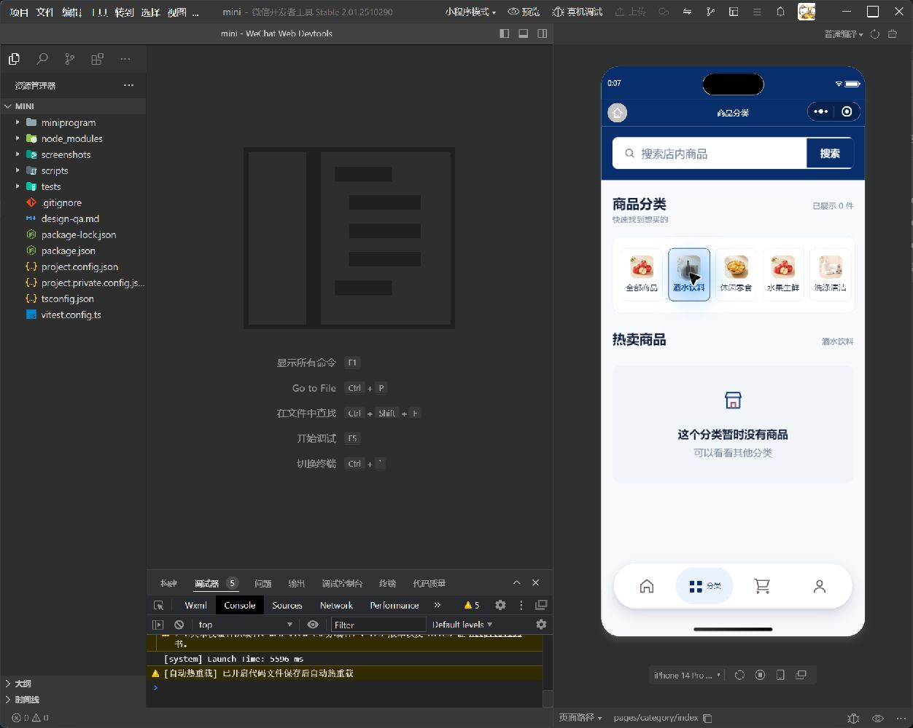

# 小程序分类页审查

## 审查范围

- 页面：`pages/category/index`
- 目标：快速识别分类、切换分类并浏览商品
- 环境：微信开发者工具，iPhone 14 Pro 模拟器，430 × 932

## 步骤 1：当前分类页

- 页面结构清楚，搜索、分类和商品列表顺序合理。
- 分类名称字号和选中态偏弱，快速扫视时不够清晰。
- “12 件”容易被理解为分类总商品数，实际是当前已加载数量。

## 步骤 2：优化后的全部商品状态

- 分类项扩大到 `120 × 152rpx`，名称字号提升到 `24rpx`。
- 选中项使用主色边框和浅色背景，状态识别更明确。
- 数量文案改为“已展示 12 件”，含义更准确。
- 分类项补充按压反馈和无障碍名称。

## 步骤 3：切换分类及空状态

- 点击“酒水饮料”后，选中态、标题和空状态同步变化。
- 空状态提供原因和继续浏览其他分类的提示。

## 证据限制

- 截图只能验证可见布局，无法证明完整的屏幕阅读器播报质量。
- 当前演示数据中“酒水饮料”没有商品，商品分类归属需要在功能和数据阶段继续核对。
- 商品图片显示为占位图，单图加载失败容错将在功能实现阶段单独处理。
